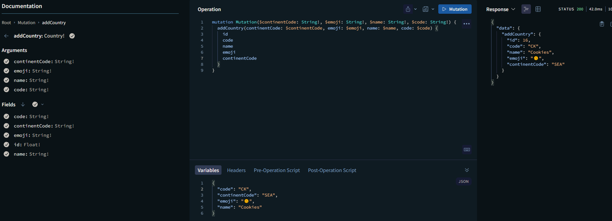
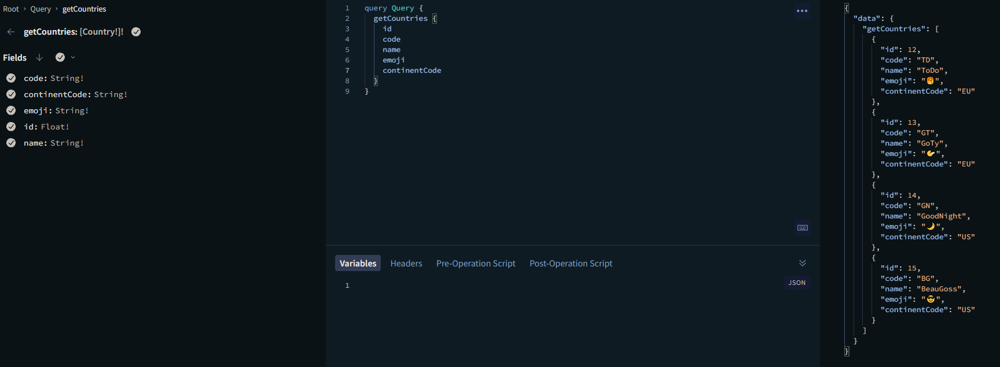
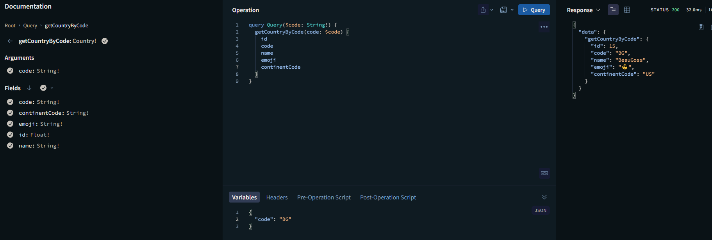
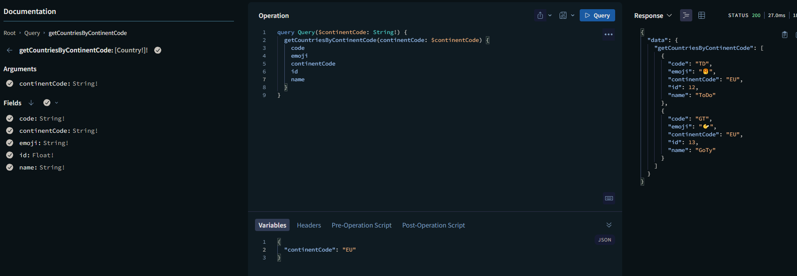

# This repository is for my CHECKPOINT 2, during my CDA apprenticeship

## Technology Knowledge Test in this Checkpoint : Apollo GraphQL + PostgreSQL + typeORM + typeGraphQL

### Setting the project:

- Create `.env file` in backend repository by copy pasting `.env.sample`

since this is a training repo, here are the right informations to match the docker-compose infos:

```js
PORT = 5010;
DB_PORT = 5432;
USERNAME = checkpoint2;
PASSWORD = checkpoint2;
DATABASE = checkpoint2_db;
```

- Create `.env.local file` in frontent repository by copy pasting `.env.sample`

since this is a training repo, here are the right informations to match the docker-compose infos:

```
NEXT_PUBLIC_API_LINK=http://localhost:5010/graphql
```

- use `docker-compose up` to launch the repository if it doesn't work, launch `docker compose up --build`

### Results Screenshots:

Mutation:



Query All Countries :



Query Country By Code :



Query Countries By Continent Code:


